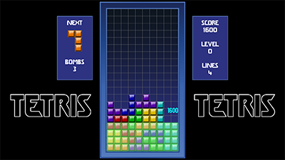
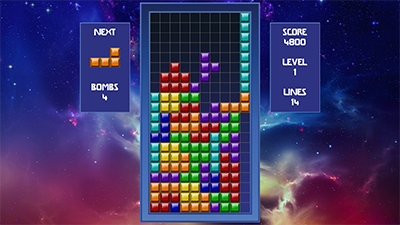
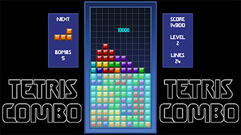
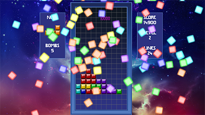

# Tetris Redux

[https://github.com/stellar7project/tetris-redux](https://github.com/stellar7project/tetris-redux)

Tetris Redux is a modern Python remake of the classic Tetris game, featuring custom graphics, music, and sound effects. This project demonstrates programming concepts such as game loops, event handling, and object-oriented design, making it ideal for educational purposes or as a portfolio piece.

---

## Table of Contents
- [Features](#features)
- [Project Structure](#project-structure)
- [Installation](#installation)
- [Usage](#usage)
- [Technologies Used](#technologies-used)
- [Learning & Challenges](#learning--challenges)
- [Demo](#demo)
- [How to Play](#how-to-play)

---

## Features
- Classic Tetris gameplay with keyboard controls  
- Scoring and level progression system  
- Custom graphics, fonts, and music  
- Menu and in-game sound effects  
- Modular Python design for easy readability and extension  

---

## Project Structure
```bash
tetris-redux/
├─ fonts/       # Custom fonts
├─ images/      # Game graphics and sprites
├─ music/       # Background music
├─ sounds/      # Sound effects
├─ sourceart/   # Original source art files
├─ .gitignore
├─ README.md
├─ file_version_info.txt
├─ tetris.ico       # Application icon
├─ tetrisAssets.py  # Asset management
├─ tetrisGame.py    # Core game logic
└─ tetrisMenu.py    # Menu and interface logic
├─ TetrisRedux.py   # Main launcher script
```

---

## Installation
1. Clone the repository:
```bash
git clone https://github.com/stellar7project/tetris-redux.git
cd tetris-redux
```
2. Ensure Python 3.12.x or 3.13.x is installed.

3. Install required package: pygame-ce 2.5.5
```bash
pip install pygame-ce
```

---

## Usage
Run the main game file to start Tetris Redux:
```bash
python TetrisRedux.py
```

---

## Technologies Used
- Python 3.13.7 + pygame-ce 2.5.5
- Object-Oriented Programming
- Modular code design
- Custom assets (images, fonts, music, sounds)

---

## Learning & Challenges
- Implemented real-time event handling for smooth gameplay
- Managed assets modularly to separate graphics, music, and sounds from game logic
- Designed an extensible structure for menus and in-game systems
- Practiced debugging and testing Python programs to ensure a stable user experience

---

## Demo
Screenshots:
[](screenshots/title_screen.png)
[](screenshots/tetris.png)
[](screenshots/combo_setup.png)
[](screenshots/tetris_combo.png)
[](screenshots/tetris_explosion.png)

Gameplay Video:
[Watch Demo (YouTube)](https://www.youtube.com/watch?v=GWF7CgeE3ME)

---

## How to Play

### Objective:

Stack falling tetrominoes to complete horizontal lines. When a line is filled, it disappears and earns points. The game ends when the stack reaches the top of the playfield or when you achieve the end level goal.

### Keyboard & Mouse Controls:
```bash
Left/Right Arrow or Mouse Movement  # Move tetromino left/right
Down Arrow or Right Mouse Button    # Drop tetromino or accelerate fall speed
Up Arrow or Mousewheel Scroll       # Rotate tetromino
Shift or Left Mouse Button          # Toggle tetromino bomb
ESC                                 # Pause / Open menu / Back to previous menu
```
Note: Keyboard controls can be modified in the Options menu under Controls.

### Special Features:

Bombs – As you progress, tetrominoes can be charged with explosive energy. When placed, they detonate on contact, clearing nearby blocks by rows. Explosions can trigger chain reactions, creating new strategies for clearing the board. Bombs are acquired by clearing a Tetris (4-lines) or for completing a Combo.

Combos – Groups of settled tetromino blocks can now fall through open spaces. Originally, they would stop at the next row that had any previously settled blocks. But now it is possible to clear multiple rows in quick succession. Each subsequent row or rows cleared is considered a combo.

Gameplay Options – In the Options menu under Gameplay, you can change the following settings:
```bash
START SPEED     # Starting fall speed (higher level means faster)
BOMB AMOUNT     # Initial bomb count
DROP MODE       # Instant drop or hold down to accelerate fall
END LEVEL       # Level goal to trigger ending (default 35)
```

Music – Background music is user-defined. Place any custom MP3 file in the music/ folder and it will be displayed as an available music track in-game.