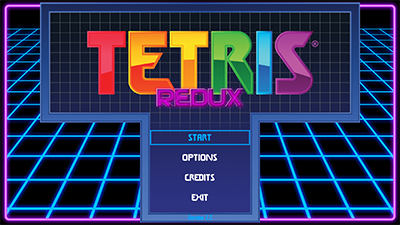

# Tetris Redux

[https://github.com/stellar7project/tetris-redux](https://github.com/stellar7project/tetris-redux)

Tetris Redux is a modern Python remake of the classic Tetris game, featuring custom graphics, music, and sound effects. This project demonstrates programming concepts such as game loops, event handling, and object-oriented design, making it ideal for educational purposes or as a portfolio piece.

---

## Table of Contents
- [Features](#features)
- [Project Structure](#project-structure)
- [Installation](#installation)
- [Usage](#usage)
- [Technologies Used](#technologies-used)
- [Learning & Challenges](#learning--challenges)
- [Demo](#demo)

---

## Features
- Classic Tetris gameplay with keyboard controls  
- Scoring and level progression system  
- Custom graphics, fonts, and music  
- Menu and in-game sound effects  
- Modular Python design for easy readability and extension  

---

## Project Structure
```bash
tetris-redux/
├─ fonts/       # Custom fonts
├─ images/      # Game graphics and sprites
├─ music/       # Background music
├─ sounds/      # Sound effects
├─ sourceart/   # Original source art files
├─ .gitignore
├─ README.md
├─ TetrisRedux.py   # Main launcher script
├─ file_version_info.txt
├─ tetris.ico       # Application icon
├─ tetrisAssets.py  # Asset management
├─ tetrisGame.py    # Core game logic
└─ tetrisMenu.py    # Menu and interface logic
```

---

## Installation
1. Clone the repository:
```bash
git clone https://github.com/stellar7project/tetris-redux.git
cd tetris-redux
```
2. Ensure Python 3.12.x or 3.13.x is installed.

3. Install required package: pygame-ce 2.5.5
```bash
pip install pygame-ce
```

---

## Usage
Run the main game file to start Tetris Redux:
```bash
python TetrisRedux.py
```

---

## Technologies Used
- Python 3.13.7 + pygame-ce 2.5.5
- Object-Oriented Programming
- Modular code design
- Custom assets (images, fonts, music, sounds)

---

## Learning & Challenges
- Implemented real-time event handling for smooth gameplay
- Managed assets modularly to separate graphics, music, and sounds from game logic
- Designed an extensible structure for menus and in-game systems
- Practiced debugging and testing Python programs to ensure a stable user experience

---

## Demo
Screenshots:
```bash
[](screenshots/title_screen.png)
[](screenshots/tetris.png)
[](screenshots/combo_setup.png)
[](screenshots/tetris_combo.png)
[](screenshots/tetris_explosion.png)
```

Gameplay Video:
[Watch Demo (YouTube)](https://www.youtube.com/watch?v=GWF7CgeE3ME)